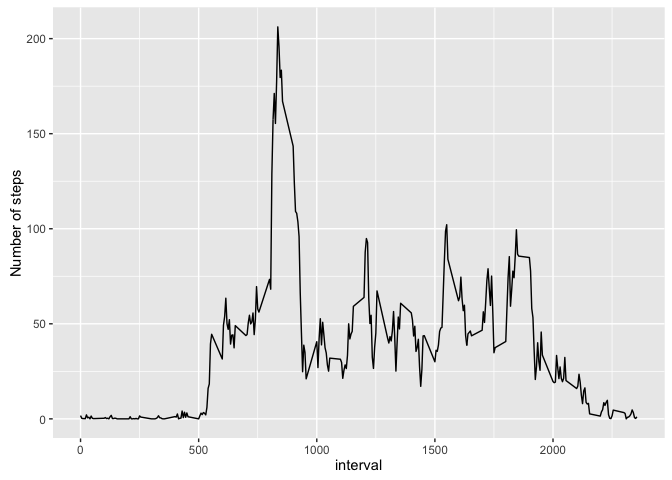

# Reproducible Research: Peer Assessment 1
Sjors  
2016-02-20  

## Load libraries


```r
library(dplyr)
```

```
## 
## Attaching package: 'dplyr'
```

```
## The following objects are masked from 'package:stats':
## 
##     filter, lag
```

```
## The following objects are masked from 'package:base':
## 
##     intersect, setdiff, setequal, union
```

```r
library(readr)
library(ggplot2)
library(lubridate)
```

## Load the data


```r
if (!file.exists("activity.csv")) {
  unzip("activity.zip")
}
activity <- tbl_df(read_csv("activity.csv"))
```

## Steps per day

Here we are going to investigate the steps per day. Therefore the total number of steps taken per day is calculated. We'll ignore the missing values in the data set.

Process the data to be grouped by day and determine the total number of steps per day:

```r
activity_by_day <- activity %>%
  group_by(date) %>%
  summarise(steps = sum(steps)) %>%
  filter(!is.na(steps))
```

The histogram of the total number of steps taken each day:

```r
qplot(steps, data = activity_by_day, binwidth = 800)
```


Where the mean of the distribution is:

```r
mean(activity_by_day$steps)
```

```
## [1] 10766.19
```

And the median of the distribution:

```r
median(activity_by_day$steps)
```

```
## [1] 10765
```

## The daily activity?

What is the average daily activity pattern?

Here we are going to investigate the average daily activity. Therefore the average number of steps per 5-min time interval is calculated. We'll ignore the missing values in the data set.

Process the data to be grouped by time interval and determine the average number of steps per time interval:

```r
activity_by_interval <- activity %>%
  filter(!is.na(steps)) %>%
  group_by(interval) %>%
  summarise(steps = mean(steps))
```

The time series looks like:

```r
qplot(interval, steps, data = activity_by_interval,
      ylab = "Number of steps",
      geom = c("line"))
```



Where the most active time interval is at minute:

```r
row <- which.max(activity_by_interval$steps)
activity_by_interval[row,]$interval
```

```
## [1] 835
```

## Imputing missing values

There are a number of days/intervals where there are missing values (coded as NA). The presence of missing days may introduce bias into some calculations or summaries of the data.

The numer of rows with missing values are: 

```r
nrow(activity[is.na(activity$steps),])
```

```
## [1] 2304
```

We strategy to fill in the missing values is to use the avearge value for that 5-minute interval. The following imputes the missing value in a new data frame:

```r
mean_steps <- function(x) {
  activity_by_interval[activity_by_interval$interval == x,]$steps
}

activity_mod <- tbl_df(data.frame(activity))
activity_mod[is.na(activity$steps),]$steps <- 
  sapply(activity[is.na(activity$steps),]$interval, mean_steps)

activity_by_day <- activity_mod %>%
  group_by(date) %>%
  summarise(steps = sum(steps))
```

The histogram of the total number of steps taken each day now looks like:

```r
qplot(steps, data = activity_by_day, binwidth = 800)
```


It very simular in shape as the one without the filled missing values. The differenc is clear in the hight of the histogram. With the missing values filled in more days are shown in the histogram, and the histogram is higher.

Where the mean of the distribution is now:

```r
mean(activity_by_day$steps)
```

```
## [1] 10766.19
```

And the median is:

```r
median(activity_by_day$steps)
```

```
## [1] 10766.19
```

## comparing weekdays and weekends

The following creates a new data set based on the one with the filled in values to group the time intervals for weekdays and weekends in order to investigate if there is a difference.

```r
days = c("weekend", rep("weekday", 5), "weekend")

activity_mod <- activity_mod %>%
  mutate(day = factor(days[wday(ymd(date, tz = "Europe/Amsterdam"))], 
                      levels = c("weekend", "weekday")))

activity_by_interval <- activity_mod %>%
  group_by(day, interval) %>%
  summarise(steps = mean(steps)) %>%
  arrange(desc(day))
```

The time series split for weekdays and weekends looks like:

```r
qplot(interval, steps, data = activity_by_interval, 
      ylab = "Number of steps",
      geom = c("line"), facets = day ~ .)
```


Especially in the morning a clear difference is observed.


